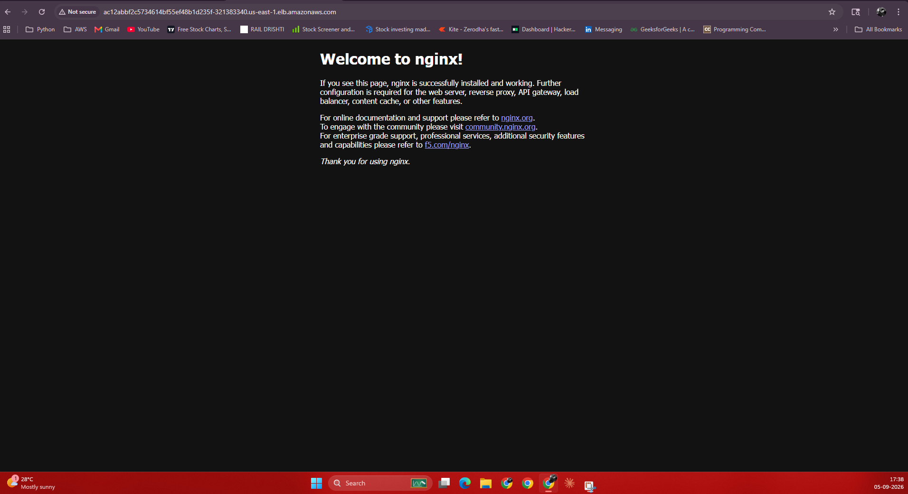

# EKS Todo App Deployment

This project provisions an Amazon EKS cluster and deploys a simple todo-style web application using a Kubernetes `Deployment` and a public `LoadBalancer` service. The infrastructure is defined in Terraform, and the application workload is defined in Kubernetes manifests under the `k8s/` folder.

## Overview

The solution creates:

- A VPC in AWS with public subnets across two Availability Zones
- An Amazon EKS cluster
- An EKS managed node group running on `t3.small` EC2 instances
- A containerized nginx-based application deployed to Kubernetes
- A public Kubernetes `Service` of type `LoadBalancer` to expose the app

This gives a simple, production-style foundation for running containerized workloads on AWS EKS.

## Architecture

```text
Internet
   |
   v
AWS ELB / LoadBalancer
   |
   v
Kubernetes Service (todo-service)
   |
   v
Pod: todo-app
   |
   v
Container: nginx:alpine
```

The infrastructure sits inside a custom VPC and EKS cluster, with public subnets enabled for internet access and Kubernetes public endpoint access.

## Terraform configuration

The Terraform code is defined in the root files:

- `main.tf` - AWS provider and core infrastructure
- `variables.tf` - configurable deployment values
- `outputs.tf` - useful outputs after deployment

### VPC setup

The VPC is created using the official Terraform AWS VPC module:

- Module source: `terraform-aws-modules/vpc/aws`
- Version: `5.1.2`
- Name: `todo-vpc`
- CIDR: `10.0.0.0/16`
- Public subnets:
  - `10.0.1.0/24`
  - `10.0.2.0/24`
- AZs used:
  - `${var.region}a`
  - `${var.region}b`
- Public subnet tagging configured for Kubernetes load balancer integration

Features enabled:

- `enable_dns_hostnames = true`
- `map_public_ip_on_launch = true`
- `enable_nat_gateway = false`

A public VPC is used here to keep the setup straightforward and suitable for a simple demo or learning environment.

### EKS cluster setup

The EKS cluster is created using the Terraform AWS EKS module:

- Module source: `terraform-aws-modules/eks/aws`
- Version: `20.8.0`
- Cluster name: `todo-cluster` by default
- Kubernetes version: `1.33`
- Cluster endpoint access: public access enabled
- VPC ID: the VPC created by the VPC module
- Subnet IDs: the public subnets from the VPC

Managed node group configuration:

- Name: `default`
- Instance type: `t3.small`
- Min size: 1
- Desired size: 2
- Max size: 2
- IAM CNI policy attached

The cluster creator is also granted admin permissions for convenience during setup and management.

## Kubernetes manifests

The app deployment is defined in `k8s/deployment.yaml` and exposed by `k8s/service.yaml`.

### Deployment

The application uses a single replica of `nginx:alpine`:

- `kind: Deployment`
- Name: `todo-app`
- Replica count: 1
- Container port: 80
- Resource requests:
  - Memory: `128Mi`
  - CPU: `100m`
- Resource limits:
  - Memory: `256Mi`
  - CPU: `250m`

This creates a lightweight web server that responds on port 80.

### Service

The app is exposed via a `LoadBalancer` service:

- `kind: Service`
- Name: `todo-service`
- Type: `LoadBalancer`
- Port: 80
- Target port: 80
- Selector: `app: todo-app`

This creates an AWS load balancer in front of the Kubernetes pod, allowing external access to the app.

## Configuration variables

The default values are defined in `variables.tf`:

- `region` = `us-east-1`
- `cluster_name` = `todo-cluster`
- `cidr` = `10.0.0.0/16`
- `public_subnets` = `["10.0.1.0/24", "10.0.2.0/24"]`

These can be customized by editing the file or by passing values through Terraform variables.

## Outputs

The project exposes some useful outputs in `outputs.tf`:

- Cluster name
- Cluster endpoint
- A `kubectl` configuration command:

```bash
aws eks update kubeconfig --name ${module.eks.cluster_name} --region ${var.region}
```

## Deployment steps

### 1. Prerequisites

Make sure you have:

- AWS CLI installed and configured
- Terraform installed
- Access to an AWS account with permission to create VPC, EKS, and IAM resources

### 2. Initialize Terraform

```bash
terraform init
```

### 3. Review the plan

```bash
terraform plan
```

### 4. Apply the infrastructure

```bash
terraform apply
```

This will create the AWS VPC and EKS cluster.

### 5. Configure Kubernetes access

After the cluster is created, run the generated update command:

```bash
aws eks update kubeconfig --name todo-cluster --region us-east-1
```

If you changed the cluster name or region in the variables, use those values instead.

### 6. Deploy the Kubernetes app

```bash
kubectl apply -f k8s/deployment.yaml
kubectl apply -f k8s/service.yaml
```

### 7. Check application status

```bash
kubectl get pods
kubectl get svc
```

You should see the `todo-app` pod and the `todo-service` load balancer service.

### 8. Access the app

Use the external IP or hostname provided by the Kubernetes LoadBalancer service:

```bash
kubectl get svc todo-service
```

Open the external address in a browser to access the nginx app.

## What this project demonstrates

This repository demonstrates several core AWS and Kubernetes concepts:

- Infrastructure as Code with Terraform
- Network setup for EKS using a VPC and public subnets
- Managed Kubernetes cluster creation in AWS
- Node group configuration for workload execution
- Container deployment with Kubernetes manifests
- Service exposure using a cloud LoadBalancer

## Notes

- The configuration is intentionally simple and suitable for learning and small demonstrations.
- The use of public subnets and a public EKS endpoint makes this easy to test, but for production workloads you would typically add stricter networking controls, private subnets, and tighter security configuration.
- The app itself is a basic nginx container; it is not a full todo application backend yet. It is a deployment example that shows how to run workloads on EKS.

## File structure

```text
.
├── README.md
├── main.tf
├── variables.tf
├── outputs.tf
├── terraform.tfvars
├── k8s/
│   ├── deployment.yaml
│   └── service.yaml
└── tfplan
```

## Summary

This project builds a complete AWS EKS environment and deploys a simple containerized web app on top of it. It combines Terraform-managed infrastructure and Kubernetes application manifests in a clean and minimal setup that can be extended into a larger workload.

